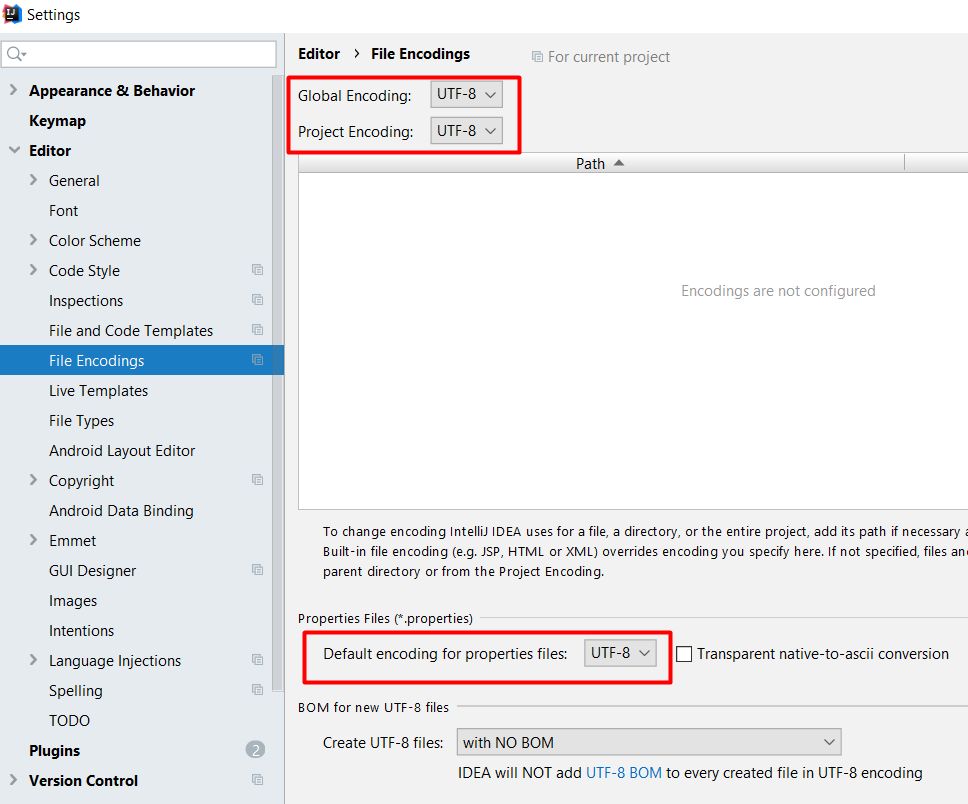

Developer guide
===============

Setup project
-------------
*   install jdk8
*   install maven

Build
-----

`mvn clean install`

Encoding
--------

Ensure all files in the project use `UTF-8` encoding.

Below is example how to configure IntelliJ IDEA:



Integration tests
-----------------

build with integration tests

    mvn test

Integration Tests are determined by maven if they reside in src/test/java folder.

Example: `src/test/java/CreateTenderTest`

If option `-skip.integrationTest` is specified then such tests are skipped during the build.

API declaration
-----------------

Test app that simulates submitting and acceptiong offerings for a tender. 
Following endpoints are available : 

1) add Tender 

```java
@RequestMapping("/{userId}")
    public List<OfferDto> getAllUserOffers(@PathVariable("userId") Long userId)
```
2) add offer 

```java
public OfferDto submitOffer(@PathVariable("tenderId") Long tenderId, @PathVariable("userId") Long userId, @RequestBody OfferDto offerDto)
```


example of body : 

{
	"amount":1.4,
	"currency": "EUR"
}


3) get all offers from one bidder

```java
public List<OfferDto> getAllUserTenderOffers(@PathVariable("tenderId") Long tenderId, @PathVariable("userId") Long userId)
```

4) get all offers from one bidder on one tender 

```java
public List<OfferDto> getAllUserTenderOffers(@PathVariable("tenderId") Long tenderId, @PathVariable("userId") Long userId)
```

5) submit a new tender 

```java
public TenderDto submitNewTender(@PathVariable("userId") Long userId, TenderCreationModel tenderDto)
```

6) list all user tenders
```java
public List<TenderDto> getAllUserOffers(@PathVariable("userId") Long userId) 
```


